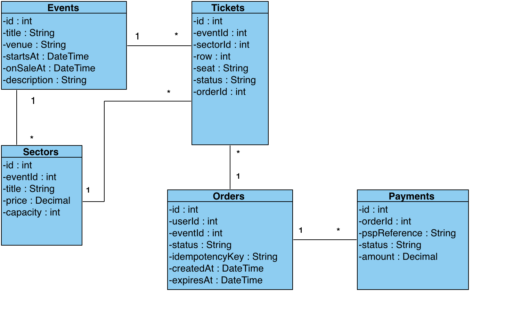
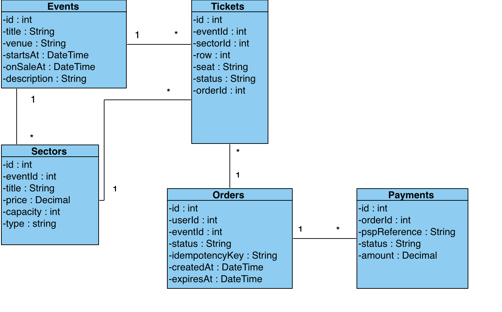
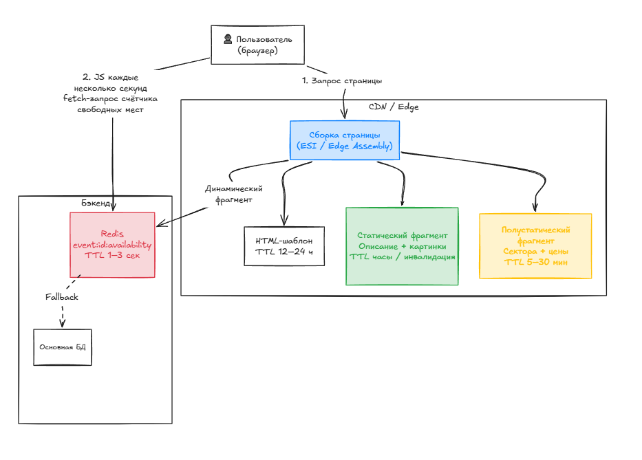

# Лабораторная работа №1  
  
Работа 1. Путь чтения: страница события  
Вопрос работы. На одной странице соседствуют описание концерта, которое не менялось три месяца, и счётчик «осталось 43 места», который устаревает за секунду. Как кэшировать страницу, у которой разные части требуют разной свежести?  
1.1. Покупатель получил билет с надписью «ложа» — без мест и количества гостей. Ответьте в схеме данных: что у вас единица инвентаря — место, ложа, входной билет? Что означает «осталось мест», если в зале есть и нумерованные места, и ложи, и фан-зона без рассадки? Покажите, как ваша модель делает невозможной ситуацию «купил, а что купил — непонятно».  
1.2. Сайт лёг в первые минуты продаж. Что видит пользователь, пришедший в 12:00:00, если система не может обслужить всех: зал ожидания с номером в очереди, честная очередь, отказ с предложением вернуться? Сравните два из них и выберите, обосновав числами.  
  
**1.1 Схема данных согласно описанию сервиса (исходная)**  
Человек оформляет заказ, состоящий из билетов, в котором указано место и ряд, которое он покупает.  
При этом ложа не имеет ряда и места, то есть в tickets для ложи отсутствовали поля row, seat, так как ложа является самостоятельным сектором.  
“Осталось мест” - сумма capacity всех секторов минус количество занятых (status = hold, sold) билетов в секторах (фактически - количество непроданных билетов). При такой схеме данных, чтобы избежать ситуации “купил, а что купил – непонятно, надо выдавать информацию о секторе, если row == NULL && seat == NULL.  

  

**Предлагаемая схема**  
  

Предлагается добавить атрибут type в таблицу sectors (тип string, значения из enum):  
“general_admission” -> общий сектор без мест (танцпол, фан-зона)  
“whole_box” -> ложа, покупается целиком  
“numbered” -> сектор, в котором обязательно все места должны определяться рядом и номером места.  

Numbered - единица инвентаря - конкретное место.  
Whole_box - единица инвентаря - весь сектор (ложа).  
General_admission - едница инвентаря - входный билет в сектор.  

В зависимости от типа сектора, к которому привязан билет в заказе, производится валидация данных билета (при numbered должны быть указаны row, seat, при whole_box и general_admission должны быть указан title).  
“Осталось мест” - в зависимости от типа сектора для numbered и general_admission это sectors.capacity минус количество уже проданных билетов. Для whole_box - количество лож, для которых нет билета с hold/sold статусами. Для ложи в пользовательском отображении должна присутствовать capacity (максимальная вместимость), чтобы было понятно, на сколько человек действует билет в ложу.  
  
**1.2 Сайт упал. Что должен видеть пользователь?**  
Варианты:  
- Зал ожидания с номером в очереди  
- Честная очередь  
- Отказ с предложением вернуться
  
**Вариант 1. Зал ожидания с номером в очереди**   
Пользователь, пришедший ровно в 12:00:00, попадает на страницу зала ожидания.  
Он видит своей примерный номер в очереди, а также ETA (“ваша очередь наступит примерно через 10 минут”). Страница периодически обновляется (реализуется через WebSocket или Long Polling). Когда освобождается место для покупки билетов, пользовать получает JWT токен с коротким TTL 5-10 минут и переходит в защищенную зону оформления билетов.  
Технически это можно реализовать как классическое решение с leaky bucket + FIFO:  
Ёмкость бакета = максимальное число одновременных пользователей в защищенной зоне оформления билетов.  
Rate of leak = максимальное количество пользователей в минуту, которое система способна перенаправить из очереди в зону покупки без деградации производительности бэкендаю  
Пользователи, зашедшие на страницу мероприятия до старта продаж, удерживаются в буферной зоне (pre-queue). В момент запуска продаж им присваивается случайный порядковый номер либо позиция на основе времени фактического захода.  
Сразу после старта система обрабатывает участников зоны ожидания (на основе случайной жеребьевки или FIFO). Все последующие пользователи встают в конец очереди в порядке их подключения.  
  
**Вариант 2. Отказ с предложением вернуться**  
Пользователь сразу получает ответ с кодом 429 / 503, страница отображает сообщение “Вернитесь позже”. Нет номера в очереди и/или гарантии порядка.  

| Метрика | Зал ожидания | Отказ с предложением вернуться |
|---------|--------------|--------------------------------|
| Нагрузка на бэкенд / БД | Регулируется объемом бакета (500–2000 RPS на основную базу данных). | Основной сервер и база данных гарантированно падают из-за нагрузки. |
| Справедливость | Очередь FIFO или randomized lottery среди участников pre-queue. | Билеты достаются ботам, перекупщикам с быстрыми прокси-серверами или тем, кто быстрее всех кликает «Обновить». |
| Темп продаж | От 500 до 2000 оформленных билетов в минуту - ровно столько, сколько система может реально обработать. | Продажи останавливаются, пока разработчики пытаются поднять сервера. |
| Пользовательский опыт | Пользователь видит: «Вы № 23 400 в очереди, примерное время ожидания - 12 минут». Это дает предсказуемость. | Пользователь видит ошибку «Сайт недоступен, попробуйте позже», постоянно обновляет страницу без гарантий перехода к странице покупки. |
  
Даже нижний порог пиковой нагрузки в 50.000 RPS превышает реальную пропускную способность основного сервера и сервиса бронирования билетов в десятки раз.  
Без зала ожидания входящий трафик мгновенно разрушает бизнес-логику приложения. Использование зала ожидания преобразует хаотичные 50 000+ RPS на внешнем контуре в безопасные 10–30 RPS внутри защищенной зоны, сохраняя систему стабильной.   
  
**2. Главный вопрос работы: Как кэшировать страницу события, у которой разные части требуют разной свежести?**  
   Страница события содержит:  
   - Статику (описание, картинки) - меняется раз в месяцы/дни.  
   - Полустатику (сектора, цены) - меняется редко, но иногда обновляется.  
   - Часто меняющиеся данные («осталось 43 места») - устаревает за 1–5 секунд в момент открытия продаж.  
     
   Решение: Fragment / component caching (кэширование компонентов) + edge assembly (ESI - Edge Sides Includes)  
   1. Шаблон страницы  
   HTML-шаблон страницы с разметкой, но без самих данных кэшируется на CDN (сеть серверов, близких к пользователю) с длинным TTL (12–24 часа).  
   2. Статический фрагмент «описание события»  
   Кэшируется отдельно на CDN на несколько часов или до ручной инвалидации при измении (инвалидация через ивенты).  
   3. Полустатический фрагмент «сектора + цены»  
   Кэшируется с TTL 5-30 минут, тоже инвалидация через ивенты.  
   4. Динамический фрагмент «осталось мест»  
   Счетчик мест выносится в in-memory БД Redis, например храним данные по ключу event:{id}:availability. TTL 1-3 секунды.  
   Когда пользователь бронирует билет, мы выполняем команды HINCRBY со значением -1, без участия тяжелой БД.  
   Вместо перезагрузки всей страницы, браузер пользователя каждые 2-5 секунд отпралвляет fetch запрос, чтобы обновить только счетчик “Осталось мест”.  
   5. Сборка  
   На edge-серверах или на бэкенде с коротким TTL полного HTML.  
   Клиент дополнительно может подтягивать количество оставшихся мест через JS каждые 2–5 с после загрузки.  

**Почему не другие варианты**  
При полном кешировании страницы на уровне CDN или веб-сервера, количество оставшихся мест будет несоответсоввать реальности слишком долго, если же поставить TTL 1s, то cache hit ratio упадет почти до 0 при пике.  
Если делать Redis-кэш всей страницы, то сложно инвалидировать части страницы независимо. И при массовом expire сразу будет большое количество запросов на обновление (эффект cache stampede).  
**Поведение при отказе**  
При 100.000 RPS зрителей страницы события, большинство запросов обслуживается из CDN, только запрос о доступности мест идет в Redis. Если Redis упал, показываем что количество мест недоступно или последнее известное значение. Остальные части страницы остаются рабочими. Если CDN упал, можно сделать fallback на бэкенд сервер. Если бэкенд упал, CDN продолжать отдавать закешированные фрагменты.  
